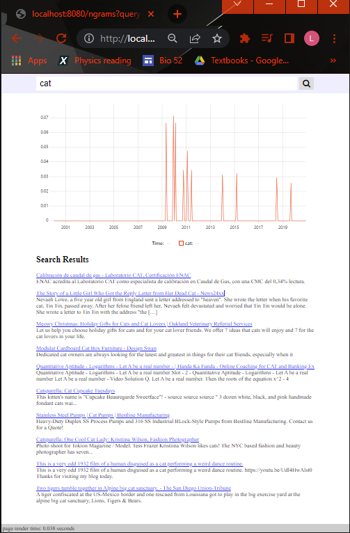

 1. This query shows the number of webpages loaded / hour:
       ```
       select * from metahtml_rollup_insert order by insert_hour desc limit 100;
       

         hll_count |  url   | hostpathquery | hostpath | host  |      insert_hour       
        -----------+--------+---------------+----------+-------+------------------------
                 7 | 117626 |        111617 |   105964 | 79696 | 2022-05-10 23:00:00+00
                 7 | 108792 |        114691 |   111266 | 84450 | 2022-05-10 22:00:00+00
       ```

    1. This query shows the hostnames that you have downloaded the most webpages from:
       ```
       select * from metahtml_rollup_host2 order by hostpath desc limit 100;

        url | hostpathquery | hostpath |                    host                     
        -----+---------------+----------+---------------------------------------------
          57 |            57 |       57 | co,coolors)
          47 |            47 |       47 | com,hp,www2,h22235)
          37 |            37 |       37 | com,dometic)
          37 |            37 |       37 | com,soundcloud)
          26 |            26 |       26 | tv,nimo)
          25 |            25 |       25 | fi,utu,mediabank)
          24 |            24 |       24 | com,pinterest,ar)
          24 |            24 |       24 | edu,virginia,med)
          27 |            27 |       23 | gov,nih,nlm,ncbi,pubmed)
          23 |            23 |       23 | com,flickr)
          22 |            22 |       22 | com,webstarterz,97475665-98-20210404113848)
          21 |            21 |       21 | com,pitchbook)
          21 |            21 |       20 | com,mapquest)
          20 |            20 |       20 | com,strava)
          20 |            20 |       20 | com,rbcroyalbank,discover)
          19 |            19 |       19 | com,karmanow)
          19 |            19 |       19 | com,pinterest,cz)
          19 |            19 |       19 | com,spotify,open)
          19 |            19 |       19 | com,archdaily,my)
          18 |            18 |       18 | com,apple,books)
          18 |            18 |       18 | cl,plataformaarquitectura,my)
          18 |            18 |       18 | dk,jyllands-posten)
          18 |            18 |       18 | com,zappos)
          18 |            18 |       18 | net,translatewiki)
         292 |           285 |       18 | com,wordpress)
          18 |            18 |       18 | com,google,patents)
          18 |            18 |       17 | com,google,docs)
          17 |            17 |       17 | gov,mi,legislature)
          17 |            17 |       17 | com,github)
          17 |            17 |       17 | com,apple,music)
          17 |            17 |       17 | com,eslgaming,photos)
          16 |            16 |       16 | jp,co,yahoo,lohaco)
          16 |            16 |       16 | ru,rlsnet)
          16 |            16 |       16 | com,lego,ideas)
          19 |            16 |       16 | eu,europa,euipo)
          16 |            16 |       16 | com,appspot,uosarch)
          16 |            16 |       16 | com,wikivisually)
          15 |            15 |       15 | com,selfridges)
          15 |            15 |       15 | com,ntn-snr,eshop)
          15 |            15 |       15 | com,20minutos)
          15 |            15 |       15 | com,pinterest)
          15 |            15 |       15 | com,microsoft,docs)
          15 |            15 |       15 | org,jpn,mitaka)
          15 |            15 |       15 | com,microsoft,azure)
          15 |            15 |       15 | com,elpais)
          15 |            15 |       15 | com,imdb)
          14 |            14 |       14 | org,wikipedia,nl)
          14 |            14 |       14 | com,adobe,stock)
          14 |            14 |       14 | com,babychakra)
          14 |            14 |       14 | com,glowing)
          14 |            14 |       14 | com,pinterest,pl)
          14 |            14 |       14 | org,azattyq)
          14 |            14 |       14 | tv,worldtruth)
          14 |            14 |       14 | tv,twitch)
          14 |            14 |       14 | org,wikipedia,de)
          14 |            14 |       14 | com,apple,tv)
          14 |            14 |       14 | com,myheritage)
          14 |            14 |       14 | com,oracle,support)
          14 |            14 |       14 | pt,ulisboa,fa,typo)
          14 |            14 |       14 | ru,travelask,bus)
          14 |            14 |       14 | net,cloudfront,dlvp94zy6vayf)
       ```

1. Take a screenshot of an interesting search result.
   Ensure that the timer on the bottom of the webpage is included in the screenshot.
   Add the screenshot to your git repo, and modify the `` tag below to point to the screenshot.

   

1. Commit and push your changes to github.

1. Submit the link to your github repo in sakai.
